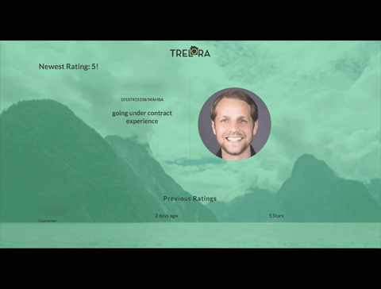
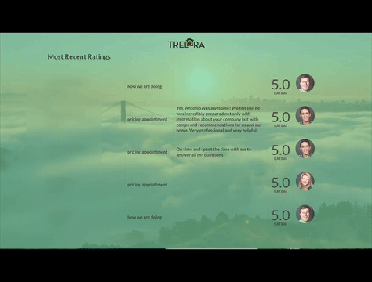
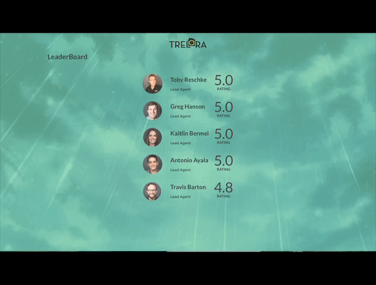
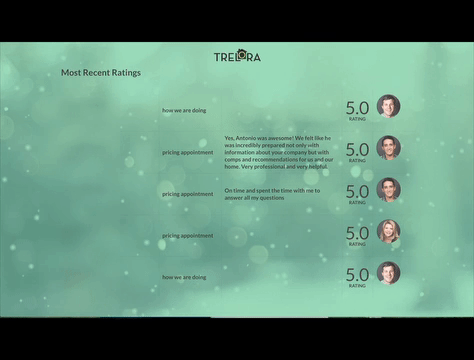

# Trelora LeaderBoard

## Description

An internal dashboard built for [Trelora](http://www.trelora.com/), a real estate company located in Denver, CO. The application displays transaction data, customer feedback, and agent rankings on office TVs. Pair Project. Private app for internal use.

### Instructions

* clone the project in your terminal by running `git clone git@github.com:acareaga/trelora-leaderboard.git/ratinganimals.git`
* start the server with `rails s` and visit `http://localhost:3000` in your preferred browser
* to run the tests, run `rspec` in the terminal

For display purpose only, API endpoints are secure.

### Areas of Focus

* consume the MyTrelora internal API
* implement a production quality user interface for office TV screens
* optimize with caching, using background workers, and AJAX requests
* complete with a partner over a period of 2 weeks

### Features
* Rails Application implemented entirely in jQuery and AJAX
* Views cycle every 30 seconds
* Dynamic background that transitions with the weather
* Designed with Trelora branding using Semantic UI
* Behavior Driven Development using Rspec, Selenium, and Capybara
* Performance measured using New Relic

